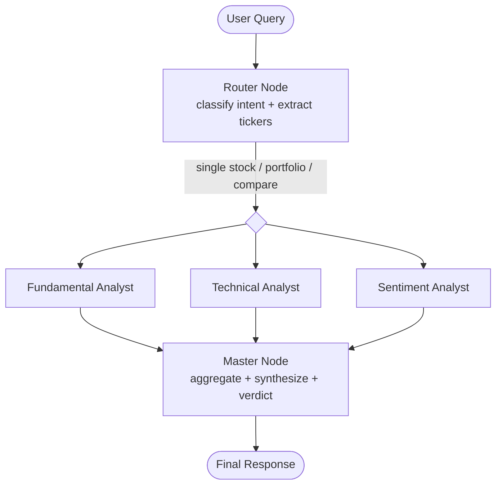

# Market Analyst — High-Level Architecture

## 1. Purpose

A multi-agent system that answers natural-language questions about Indian equities:

1. **Single stock check** — "How is Reliance doing?"
2. **Portfolio check** — "How is my portfolio doing?" (Tata Motors, M&M, Infosys, ...)
3. **Comparison / recommendation** — "Compare Tata Motors & Mahindra, which should I buy?"

The system fans a query out to three specialist analyst agents (fundamental, technical, sentiment) that run **in parallel**, then a master/orchestrator node compiles their outputs into a single synthesized answer with a verdict.

---

## 2. Tech Stack

| Layer | Choice | Notes |
|---|---|---|
| Agent orchestration | **LangGraph** | Graph of nodes: router → parallel analysts → aggregator |
| Market data | **yfinance** | NSE tickers use `.NS` suffix (e.g. `RELIANCE.NS`), BSE uses `.BO` |
| Web/news search | **DuckDuckGo Search** (`ddgs` / `duckduckgo-search` package) | Free, no API key |
| LLM | **Google Gemini** via `langchain-google-genai` | Free tier, `GOOGLE_API_KEY` env var; keep swappable for other LangChain chat models later |
| Backend API | **FastAPI** | Exposes the LangGraph app over HTTP for testing/integration |
| Frontend | **Streamlit** | Chat-style UI, calls the FastAPI backend |
| Caching | In-process TTL cache (e.g. `cachetools`) for market data & search results | Avoid re-hitting yfinance/DDG on every rerun |
| Package/env mgmt | `uv` or `poetry` + `.env` for config | — |

---

## 3. Repository Layout

```
market_analyst/
├── docs/
│   └── architecture.md
├── backend/
│   ├── app/
│   │   ├── main.py                 # FastAPI app, routes
│   │   ├── api/
│   │   │   ├── routes.py           # /analyze, /portfolio, /compare, /health
│   │   │   └── schemas.py          # Pydantic request/response models
│   │   ├── agents/
│   │   │   ├── state.py            # Shared LangGraph state (TypedDict)
│   │   │   ├── graph.py            # LangGraph graph builder (the wiring)
│   │   │   ├── router.py           # Intent classification / query routing node
│   │   │   ├── fundamental_agent.py
│   │   │   ├── technical_agent.py
│   │   │   ├── sentiment_agent.py
│   │   │   └── master_agent.py     # Aggregator / synthesis + verdict node
│   │   ├── tools/
│   │   │   ├── market_data.py      # yfinance wrappers
│   │   │   ├── web_search.py       # DuckDuckGo wrapper
│   │   │   └── symbols.py          # Ticker resolution (name -> NSE/BSE symbol)
│   │   ├── core/
│   │   │   ├── config.py           # Settings (env vars, model name, keys)
│   │   │   ├── cache.py            # TTL cache helper
│   │   │   └── logging.py
│   │   └── prompts/
│   │       ├── fundamental.py
│   │       ├── technical.py
│   │       ├── sentiment.py
│   │       └── master.py
│   └── tests/
│       ├── test_tools.py
│       ├── test_agents.py
│       └── test_api.py
├── frontend/
│   └── streamlit_app.py            # Chat UI, calls backend via requests/httpx
├── .env.example
├── pyproject.toml
└── README.md
```

---

## 4. Multi-Agent Design (LangGraph)

### 4.1 Graph shape



- LangGraph's fan-out/fan-in is implemented by having the **router node** return multiple edges (to `fundamental_analyst`, `technical_analyst`, `sentiment_analyst`) that all target the **same downstream node** (`master_node`). LangGraph runs those branches concurrently (each as a separate super-step) and the master node only executes once all three have written their piece of shared state (implicit join via `Annotated` reducers in the state schema).
- For **portfolio** and **compare** queries, the router extracts a *list* of tickers. Each analyst agent internally loops/batches over the ticker list (still a single node invocation) rather than exploding the graph into per-ticker nodes — simpler to implement and reason about first; can be upgraded to `Send()`-based dynamic fan-out per ticker later if parallelism-per-symbol is needed.

### 4.2 Shared State Schema (`agents/state.py`)

```python
from typing import TypedDict, Annotated, Literal
import operator

class AnalystFinding(TypedDict):
    ticker: str
    summary: str
    score: float          # normalized -1 (bearish) to +1 (bullish)
    key_points: list[str]
    raw_data: dict         # source data used, for traceability

class AnalysisState(TypedDict):
    query: str
    intent: Literal["single_stock", "portfolio", "compare"]
    tickers: list[str]                      # resolved NSE/BSE symbols
    portfolio: dict[str, float] | None      # ticker -> qty/weight, if known

    fundamental_findings: Annotated[list[AnalystFinding], operator.add]
    technical_findings: Annotated[list[AnalystFinding], operator.add]
    sentiment_findings: Annotated[list[AnalystFinding], operator.add]

    final_answer: str
    verdict: dict | None                    # e.g. {"recommendation": "BUY M&M", "confidence": 0.7}
    errors: Annotated[list[str], operator.add]
```

Using `Annotated[..., operator.add]` reducers lets each parallel analyst branch append its findings to state independently without conflicting writes, which is how LangGraph resolves concurrent updates to the same state key.

### 4.3 Node responsibilities

**Router node (`router.py`)**
- Classifies the query into `single_stock | portfolio | compare`.
- Extracts company names/tickers via LLM (or regex/dictionary lookup first, LLM fallback) and resolves them to Yahoo Finance symbols via `tools/symbols.py` (e.g. "Reliance" → `RELIANCE.NS`, "Tata Motors" → `TATAMOTORS.NS`, "M&M" → `M&M.NS`).
- If intent is `portfolio` and the user didn't list holdings in-message, pulls from a stored/session portfolio (see §6).

**Fundamental Analyst (`fundamental_agent.py`)**
- Tools: `market_data.get_fundamentals(ticker)` → P/E, EPS, market cap, revenue/earnings growth, debt/equity, sector, `yfinance` `.info`/`.financials`/`.balance_sheet`.
- LLM reasons over the numbers to produce a summary, bullish/bearish score, and key points.

**Technical Analyst (`technical_agent.py`)**
- Tools: `market_data.get_price_history(ticker, period, interval)` → OHLCV via `yfinance.download`/`Ticker.history`.
- Computes indicators (SMA/EMA, RSI, MACD, volume trend, 52-week high/low) — via `pandas`/`ta` library — then LLM interprets trend/momentum into a summary + score.

**Sentiment Analyst (`sentiment_agent.py`)**
- Tools: `web_search.search_news(query, max_results)` using DuckDuckGo (news + general search) for recent headlines/articles about the ticker/company.
- LLM summarizes news tone (positive/negative/neutral), notable events (earnings, regulatory, management changes), produces score + key points with source snippets.

**Master node (`master_agent.py`)**
- Reads all three `*_findings` lists from state.
- For `single_stock`: synthesizes one narrative answer.
- For `portfolio`: produces a per-holding mini-summary + overall portfolio health view.
- For `compare`: builds a side-by-side comparison table across the three dimensions and issues a final recommendation with reasoning and confidence, explicitly noting it's not financial advice.
- Writes `final_answer` and `verdict` to state.

---

## 5. Tool Layer

### 5.1 `tools/market_data.py` (yfinance wrapper)
```python
def get_quote(ticker: str) -> dict: ...            # current price, change %, day range
def get_price_history(ticker: str, period="6mo", interval="1d") -> pd.DataFrame: ...
def get_fundamentals(ticker: str) -> dict: ...      # info dict subset + financial statements
def get_technical_indicators(ticker: str) -> dict: ...  # SMA/EMA/RSI/MACD computed from history
```
- Wrap all calls with retry + TTL cache (quotes: ~1 min TTL; fundamentals: ~1 day TTL) to respect Yahoo Finance rate limits.
- Centralize error handling: return a structured `{"error": ...}` instead of raising, so agents can degrade gracefully.

### 5.2 `tools/web_search.py` (DuckDuckGo wrapper)
```python
def search_news(query: str, max_results: int = 8) -> list[dict]: ...  # title, url, snippet, date
def search_general(query: str, max_results: int = 5) -> list[dict]: ...
```
- Built on the `ddgs` package's `DDGS().news(...)` / `DDGS().text(...)`.
- Cache per (query, day) to avoid duplicate calls within a session.

### 5.3 `tools/symbols.py`
- Small curated dict of common Indian companies → NSE symbol (seed with NIFTY 50 names: Reliance, TCS, Infosys, HDFC Bank, Tata Motors, M&M, ICICI Bank, etc.), with LLM-assisted fuzzy fallback for anything not in the map.
- Normalizes to `.NS` (default) with `.BO` fallback if `.NS` lookup fails on yfinance.

---

## 6. Portfolio Handling

- MVP: user provides holdings inline in the query, or via a simple Streamlit sidebar form (ticker + quantity) stored in `st.session_state` and passed to the backend per-request — no DB needed initially.
- Backend `/portfolio` request body carries `{"holdings": [{"ticker": "TATAMOTORS.NS", "qty": 10}, ...]}` so the FastAPI layer stays stateless.
- Future extension: persist portfolios per user in a lightweight store (SQLite) — out of scope for v1.

---

## 7. FastAPI Backend

**`backend/app/main.py`** exposes:

| Method | Path | Body | Description |
|---|---|---|---|
| GET | `/health` | — | liveness check |
| POST | `/analyze` | `{"query": "How is Reliance doing?"}` | Runs full graph, auto-detects intent |
| POST | `/portfolio` | `{"holdings": [...]}` | Forces `portfolio` intent |
| POST | `/compare` | `{"tickers": ["TATAMOTORS.NS", "M&M.NS"]}` | Forces `compare` intent |

Response schema (all endpoints return the same shape):
```json
{
  "intent": "compare",
  "tickers": ["TATAMOTORS.NS", "M&M.NS"],
  "findings": {
    "fundamental": [...],
    "technical": [...],
    "sentiment": [...]
  },
  "verdict": {"recommendation": "...", "confidence": 0.0},
  "final_answer": "markdown-formatted narrative",
  "errors": []
}
```

The route handlers simply build the initial `AnalysisState`, call `graph.invoke(state)` (LangGraph app compiled once at startup), and return the relevant fields via a Pydantic response model.

---

## 8. Streamlit Frontend

- Single chat-style page (`frontend/streamlit_app.py`):
  - Text input for free-form queries → POST `/analyze`.
  - Sidebar: "My Portfolio" form to add/remove holdings, stored in `st.session_state`; a "How is my portfolio doing?" button posts to `/portfolio`.
  - Renders `final_answer` (markdown) plus expandable sections per analyst (fundamental/technical/sentiment) showing scores and key points, and a verdict banner for compare queries.
  - Uses `httpx`/`requests` to call the FastAPI backend URL (configurable via env var, default `http://localhost:8000`).

---

## 9. Example End-to-End Flows

**Query 1 — "How is Reliance doing?"**
Router → intent=`single_stock`, tickers=[`RELIANCE.NS`] → fundamental/technical/sentiment run in parallel on that one ticker → master synthesizes one narrative ("Reliance is trending up technically, fundamentals solid, sentiment mixed due to X news...").

**Query 2 — "How is my portfolio doing?"**
Router → intent=`portfolio`, tickers = user's holdings → each analyst loops over all tickers → master produces per-stock summary + aggregate portfolio view (winners/laggards, overall sentiment).

**Query 3 — "Compare Tata Motors & Mahindra, which should I buy?"**
Router → intent=`compare`, tickers=[`TATAMOTORS.NS`, `M&M.NS`] → analysts produce findings for both → master builds a comparison table and a final recommendation with confidence + caveats.

---

## 10. Cross-Cutting Concerns

- **Parallelism**: LangGraph's native concurrent branch execution handles the fan-out; no manual `asyncio.gather` needed at the graph level, though individual tool calls inside a node can still be async/batched.
- **Resilience**: every tool call is wrapped to catch exceptions and append to `state.errors` rather than failing the whole graph; master node notes any missing data in the final answer.
- **Caching**: TTL cache shared across requests (in-process `cachetools.TTLCache`, upgradeable to Redis later) for both yfinance and DuckDuckGo calls.
- **Rate limits**: DuckDuckGo search is unauthenticated and can throttle — add small retry/backoff and cap `max_results`.
- **Disclaimers**: master node always appends a "not financial advice" note to any recommendation.
- **Testing**: `backend/tests` covers tool wrappers (mocked yfinance/DDG responses), each agent node in isolation (fixture state in, assert findings shape out), and API endpoints via FastAPI's `TestClient`.

---

## 11. Suggested Build Order

1. `tools/market_data.py`, `tools/web_search.py`, `tools/symbols.py` + unit tests.
2. `agents/state.py` + individual agent nodes (unit test each with a fixed ticker).
3. `agents/graph.py` wiring the fan-out/fan-in graph; test with `graph.invoke()` directly.
4. FastAPI routes wrapping the compiled graph.
5. Streamlit UI hitting the FastAPI backend.
6. Add caching, error resilience, portfolio form, comparison table polish.
